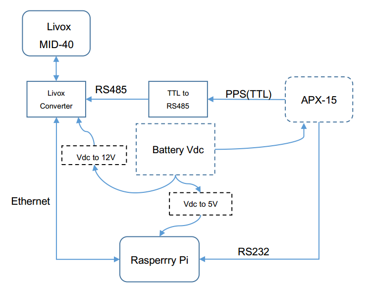

# 1. Background

With their high performance, Livox LiDARs can be used in a variety of applications including autonomous driving, UAVs, high precision mapping. Among these applications, it is a common practice to fuse the LiDAR point cloud data with a GNSS-INS system to compensate any motion during the data collection. In this document, we provide a guideline for users to integrate Livox LiDARs to a GNSS-INS system. We will take two GNSS-INS modules as explanatory examples: [APX-15](https://www.applanix.com/downloads/products/specs/APX15_DS_NEW_0408_YW.pdf) and [uINS Module](https://inertialsense.com/products/gnss-ins-rtk-sensors/).

# 2. List of Devices

1. Livox MID-40
2. Livox Converter
3. [APX-15 module](https://www.applanix.com/products/dg-uavs.htm "test")
4. [TTL-RS485 Converter](https://www.amazon.com/NOYITO-Multi-Machine-Communication-Ultra-Long-Distance-Transmission/dp/B07BJJ7ZF8/ref=sr_1_16?ie=UTF8&amp;qid=1548410775&amp;sr=8-16&amp;keywords=ttl+to+rs485)
5. Onboard Computer with SD card([Raspberry Pi 3 B+](https://www.raspberrypi.org/products/raspberry-pi-3-model-b/))
6. [DC-DC Converter](https://www.amazon.com/uxcell-Converter-Regulator-Transformer-Waterproof/dp/B01ARRAWE4/ref=sr_1_5_acs_ac_3?ie=UTF8&amp;qid=1548669239&amp;sr=8-5-acs&amp;keywords=24v%2Bto%2B12v%2Bdc%2Bconverter&amp;th=1)(Ouput:12V, 10A for Livox LiDAR)
7. [DC-DC Converter](https://www.amazon.com/DROK-Synchronous-Transformer-Electromobile-Automotive/dp/B00KL770IC/ref=sr_1_7?ie=UTF8&amp;qid=1548859639&amp;sr=8-7&amp;keywords=24V+to++5V)(Output:5V, 3A for Raspberry Pi )

# 3. System Blockdiagram



Remarks:

1. The required voltage range for Livox MID-40, Raspberry Pi, and APX-15 are 10-16V, 5V and 8-32V, respectively. DC-DC converters with proper output voltage level are needed in case Vdc is not in the respective range.
2. The PPS output of APX-15 is in TTL level, while the PPS input of Livox MID-40 is RS485. A TTL-RS485 Converter is needed to convert the signal level.
3. Livox MID-40 transmits point cloud data to Raspberry Pi via Ethernet port.
4. APX-15 transmits pose data to Raspberry Pi via RS232 port.
5. Raspberry Pi supports SD cards for data storage.
6. GPS antenna of the APX-15 should be placed at proper locations to avoid interference from other modules.

# 4. Time Synchronization

Once powered on, APX-15 will sample and process pose (position and attitude) data at a given rate, the data are packed with the GPS time and sent to the Raspberry Pi via the RS232 port. Meanwhile, the APX-15 transmits one pulse per second and the rising edge of each pulse (the rising edge) occurs per seconds (i.e., 1 sec, 2 sec, 3 sec…).

A Livox LiDAR sends data packets to Raspberry Pi via the Ethernet port at 1kHz (1000 data packets per second). Each data packet has a timestamp, 100 points data, and status information ([the manual of Livox MID-40](https://www.livoxtech.com/3296f540ecf5458a8829e01cf429798e/downloads/20190129/Livox%20Mid%20Series%20User%20Manual%20EN%2020190129%20v1.0.pdf)). The timestamp indicates the time (in nano-seconds) of the first data point within this packet from the rising edge of the most recent pulse occurs on the LiDAR PPS port. As the LiDAR samples points at a regular time period (10us for MID40 and each of the three units within a MID100), the timestamp for each point within a packet could be inferred from the timestamp of the first point.

Assume the GPS time is time TA ms within week WA，and the timestamp in a Livox LiDAR data packet is T ms，below pseudo codes show how to align the time-line of point data from Livox LiDARs to that of APX-15. In below pseudo codes, WL denotes the week number of the timestamp of the point cloud data packet and TL denotes the time in ms within that week.
```
TAms = TA mod 1000
TAs  = FLOOR ( TA  / 1000 )
IF | TA – T | < 500 THEN
    TL = TAs *1000 + T
    WL = WA
ELSE IF TAms > T THEN
    TL = (TAs  +  1 ) * 1000 + T
    IF TL > 7 * 24 * 3600 *1000 THEN
    TL = T
    WL = WA + 1
ELSE IF TAms < T THEN
    TL = (TAs – 1 ) *1000 + T
    IF TL < 0 THEN
    TL = 7 * 24 * 3599*1000 + T
    WL = WA - 1
```