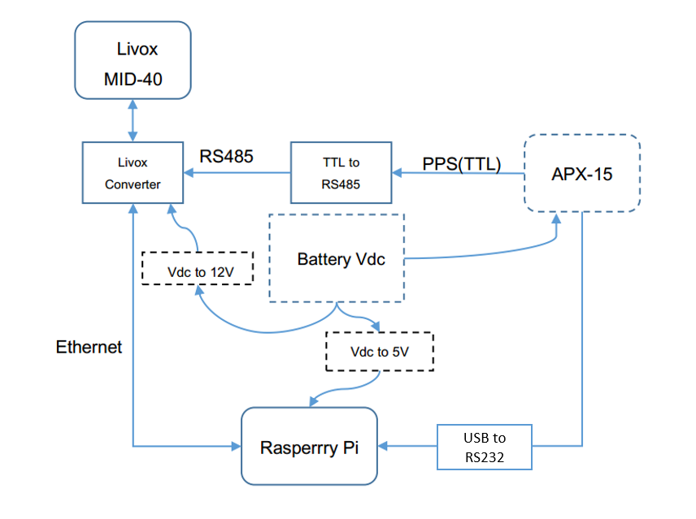
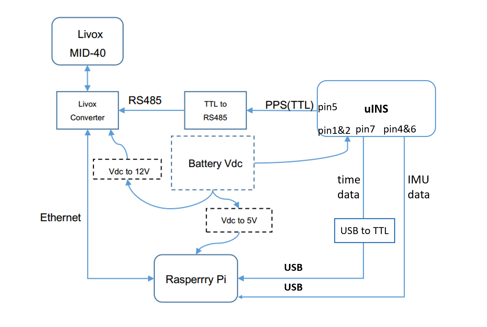

# 1 Background

With their high performance, Livox LiDARs can be used in a variety of applications including autonomous driving, UAVs, high precision mapping. Among these applications, it is a common practice to fuse the LiDAR point cloud data with a GNSS-INS system to compensate any motion during the data collection. In this document, we provide some references for users to integrate Livox LiDARs to a GNSS-INS system. We will take two GNSS-INS modules as explanatory examples: [APX-15](https://www.applanix.com/downloads/products/specs/APX15_DS_NEW_0408_YW.pdf) and [uINS Module](https://inertialsense.com/µins-rtk/#INS-sensors).

# 2 Integrating with APX-15

## 2.1 List of Devices

1. Livox MID-40
2. Livox Converter
3. [APX-15 module](https://www.applanix.com/products/dg-uavs.htm "test")
4. [TTL-RS485 Converter](https://www.amazon.com/NOYITO-Multi-Machine-Communication-Ultra-Long-Distance-Transmission/dp/B07BJJ7ZF8/ref=sr_1_16?ie=UTF8&amp;qid=1548410775&amp;sr=8-16&amp;keywords=ttl+to+rs485)
5. USB to RS232 module
6. Onboard Computer with SD card([Raspberry Pi 3 B+](https://www.raspberrypi.org/products/raspberry-pi-3-model-b/))
7. [DC-DC Converter](https://www.amazon.com/uxcell-Converter-Regulator-Transformer-Waterproof/dp/B01ARRAWE4/ref=sr_1_5_acs_ac_3?ie=UTF8&amp;qid=1548669239&amp;sr=8-5-acs&amp;keywords=24v%2Bto%2B12v%2Bdc%2Bconverter&amp;th=1)(Ouput:12V, 10A for Livox LiDAR)
8. [DC-DC Converter](https://www.amazon.com/DROK-Synchronous-Transformer-Electromobile-Automotive/dp/B00KL770IC/ref=sr_1_7?ie=UTF8&amp;qid=1548859639&amp;sr=8-7&amp;keywords=24V+to++5V)(Output:5V, 3A for Raspberry Pi)

## 2.2 System Block Diagram

Remarks:

1. The required voltage range for Livox MID-40, Raspberry Pi, and APX-15 are 10-16V, 5V and 8-32V, respectively. DC-DC converters with proper output voltage level are needed in case Vdc is not in the respective range.
2. The PPS output of APX-15 is in TTL level, while the PPS input of Livox MID-40 is RS485. A TTL-RS485 Converter is needed to convert the signal level.
3. Livox MID-40 transmits point cloud data to Raspberry Pi via Ethernet port.
4. APX-15 transmits pose and time information($GNRMC) to Raspberry Pi via RS232 port.
6. GPS antenna of the APX-15 should be placed at proper locations to avoid interference from other modules.
7. We recommend using [Jetson TX2](https://developer.nvidia.com/embedded/jetson-tx2) or [DJI manifold-2]( https://www.dji.com/cn/manifold-2) instead of Raspberry Pi because they have better performance.

# 3. Integration with uINS

## 3.1 List of Devices

1. Livox MID-40
2. Livox Converter
3. [uINS Module](https://inertialsense.com/µins-rtk/#INS-sensors)
4. [TTL-RS485 Converter](https://www.amazon.com/NOYITO-Multi-Machine-Communication-Ultra-Long-Distance-Transmission/dp/B07BJJ7ZF8/ref=sr_1_16?ie=UTF8&amp;qid=1548410775&amp;sr=8-16&amp;keywords=ttl+to+rs485)
5. USB to TTL module
6. Onboard Computer with SD card([Raspberry Pi 3 B+](https://www.raspberrypi.org/products/raspberry-pi-3-model-b/))
7. [DC-DC Converter](https://www.amazon.com/uxcell-Converter-Regulator-Transformer-Waterproof/dp/B01ARRAWE4/ref=sr_1_5_acs_ac_3?ie=UTF8&amp;qid=1548669239&amp;sr=8-5-acs&amp;keywords=24v%2Bto%2B12v%2Bdc%2Bconverter&amp;th=1)(Ouput:12V, 10A for Livox LiDAR)
8. [DC-DC Converter](https://www.amazon.com/DROK-Synchronous-Transformer-Electromobile-Automotive/dp/B00KL770IC/ref=sr_1_7?ie=UTF8&amp;qid=1548859639&amp;sr=8-7&amp;keywords=24V+to++5V)(Output:5V, 3A for Raspberry Pi)

## 3.2 System Block Diagram

Remarks:

1. The required voltage range for Livox MID-40, Raspberry Pi, and uINS are 10-16V, 5V and 4-20V, respectively. DC-DC converters with proper output voltage level are needed in case Vdc is not in the respective range.
2. The PPS output of uINS is in TTL level, while the PPS input of Livox MID-40 is RS485. A TTL-RS485 Converter is needed to convert the signal level.
3. Configure uINS to output time($GPRMC) information through Serial 0 port with TTL level. You don’t need a USB to TTL module, if you connect pin7 directly to the UART RX port of Raspberry Pi or other PC(if it has UART port).
4. Configure uINS to output position and attitude data through USB port. These two(time data and imu data) do not use the same port because the synchronization program will occupy a single COM port.
5. We recommend using [Jetson TX2](https://developer.nvidia.com/embedded/jetson-tx2) or [DJI manifold-2]( https://www.dji.com/cn/manifold-2) instead of Raspberry Pi because they have better performance.

# 4. Time Synchronization

In the latest SDK(v2.0.0+) and ROS driver, we have integrated the time synchronization logic.

## 4.1 Use ROS driver

- Connect the hardware according to the above block diagram;
- View the name of the port receiving time data(GPRMC/GNRMC) in the system, such as `/dev/ttyUSB0`, configure "device_name" to this name in the file [livox_lidar_config.json](https://github.com/Livox-SDK/livox_ros_driver/blob/master/livox_ros_driver/config/livox_lidar_config.json), and set "enable_timesync" to `true`;
- Run the launch file;

If all goes well, the timestamp in every point cloud package will be aligned with the GPS time.

## 4.2 Use only SDK

The link below is an example showing how to synchronize using only SDK:

[https://github.com/Livox-SDK/Livox-SDK/tree/master/sample_cc/lidar_utc_sync](https://github.com/Livox-SDK/Livox-SDK/tree/master/sample_cc/lidar_utc_sync)

